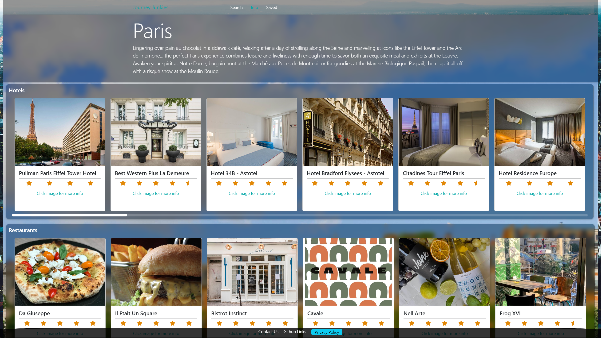

# React Portfolio

## Description

This is a travel application created as part of my final group project during my coding skills bootcamp. This project was created using the React library alongside various components and APIs.

Components:

* [React Router](https://reactrouter.com/en/main)
* [Leaflet](https://www.npmjs.com/package/leaflet)
* [Framer Motion](https://www.framer.com/motion/)

APIs:

* [Travel Advisor](https://rapidapi.com/apidojo/api/travel-advisor)
* [Open Street Maps](https://wiki.openstreetmap.org/wiki/API)

## Table of Contents

* [Installation](#installation)

* [Usage](#usage)

* [License](#license)

* [Contributing](#contributing)

* [Tests](#tests)

* [Page preview](#page-preview)

* [Questions](#questions)

## Installation

n/a

## Usage

Please follow the link to the deployed page: [Journey Junkies](https://gthornbuckle-journeyjunkies.netlify.app/)

## License

This project is licensed under: MIT License

## Contributing

n/a

## Tests

To test this project, please run the command:

n/a

## Page Preview

[Deployed Page](https://gthornbuckle-journeyjunkies.netlify.app/)

## Questions

For any questions relating to this project please contact using the following links:

GitHub: [gthornbuckle](https://github.com/gthornbuckle/)

Email: gthornbuckle@gmail.com
